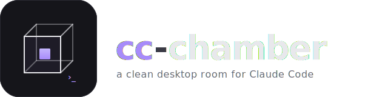

<div align="center">



**A clean desktop room for [Claude Code](https://docs.claude.com/en/docs/claude-code) — terminal, markdown chat, file browser, sessions per project.**

[](https://github.com/Marcel-I-T/cc-chamber/releases/latest)
[](./LICENSE)
[](https://github.com/Marcel-I-T/cc-chamber)
[](https://www.electronjs.org)
[](https://react.dev)
[](https://www.typescriptlang.org)

</div>

---

> ⚠️ **Unofficial.** Not affiliated with, endorsed by, or sponsored by Anthropic
> or the Open Chamber project. "Claude" and "Claude Code" are trademarks of
> Anthropic, PBC. Open Chamber / OpenCode belong to their respective authors.
> This project just wraps the official `claude` CLI for personal, local use —
> no Anthropic code or binaries are redistributed.

---

## Why

The [`claude` CLI](https://docs.claude.com/en/docs/claude-code) is great in the terminal, but eventually you want:

- A persistent **sessions list** per project — not "which tab was that one again?"
- A **file tree** that survives session switches
- A **markdown chat view** for when you want responses to read like docs, not a TUI
- A toggle for **`--dangerously-skip-permissions`** that doesn't need editing your shell history

`cc-chamber` is a thin Electron shell around the official `claude` binary that gives you that, while letting `claude` do everything it normally does. You stay on your own subscription, your sessions stay on your machine, and you can drop back to the raw TUI any time.

## ✨ Features

| | |
|---|---|
| 🏠 **Projects → Sessions** | Sidebar lists projects (= directories), each with its own session list. Collapsible, renameable, color-tagged. |
| 💬 **Terminal ⇄ Chat toggle** | Per session, flip between full `claude` TUI and a markdown chat view. Same project context. |
| 📁 **File browser** | Right sidebar with type-colored icons, lazy-loaded subfolders, search. |
| 🎨 **Bottom composer** | Model picker (Default / Sonnet / Opus), Plan/Build mode, slash commands, attachments. |
| 🔐 **Skip-perms toggle** | `--dangerously-skip-permissions` as a per-session toggle. |
| 💾 **Persistent everything** | Projects, sessions, chat threads survive refresh and app restart. Terminal sessions resume with `--continue`, chats with `--resume <session-id>`. |
| ⚡ **Two-spawn modes** | Long-running PTY for TUI, headless `claude -p --output-format json` for chat. |
| 🪟 **OC-style layout** | Header / Sidebar / Main / RightSidebar / BottomDock — proven structure, customised for terminal-first workflow. |

## 🚀 Quickstart

```bash
# Prerequisites: macOS, Node.js 20+, Claude Code CLI installed & signed in
git clone https://github.com/Marcel-I-T/cc-chamber.git
cd cc-chamber
npm install                # installs deps + builds the native PTY
npm link                   # makes `cc-chamber` available globally
cc-chamber                 # auto-builds UI on first run, then launches
```

After the first run the UI bundle is cached, so subsequent launches start in under a second.

### CLI flags

```
cc-chamber              launch (auto-builds UI if needed)
cc-chamber --dev        Vite + Electron with HMR
cc-chamber --build      rebuild UI bundle without launching
cc-chamber --version    print version
cc-chamber --help       show this list
```

### Build a DMG

For a notarized, distributable DMG (no Gatekeeper warnings):

```bash
cp .env.example .env
# Fill in APPLE_ID / APPLE_APP_SPECIFIC_PASSWORD / APPLE_TEAM_ID
npm run build:app
# Output: release/cc-chamber-*.dmg  (signed + notarized + stapled)
```

You need a paid Apple Developer Program account ($99/yr) and a `Developer ID
Application` certificate installed in your Keychain. The app-specific password
is generated at <https://appleid.apple.com/> under "Sign-in and Security".

For a quick local-only build without notarization:

```bash
npm run build:app:adhoc
# Output: ad-hoc signed DMG — opens with "Open Anyway" via System Settings
```

## 🧠 How it works

```
                          ┌──────────────────────────────────┐
   (your subscription)    │  Electron renderer (React + TS)  │
                          │ ────────────────────────────────  │
                          │  Sidebar  │  Terminal  │ Files    │
                          │           │   or Chat  │          │
                          └────┬─────────────┬─────────┬──────┘
                               │ IPC         │ IPC     │ IPC
                          ┌────▼──────┐ ┌────▼─────┐ ┌─▼──────┐
                          │ node-pty  │ │  claude  │ │ fs.list │
                          │  spawn    │ │  -p ...  │ │         │
                          │ claude    │ │  --json  │ │         │
                          └───────────┘ └──────────┘ └────────┘
                                │             │
                                └──────┬──────┘
                                       ▼
                                 your Claude
                                 subscription
```

- **Terminal mode** spawns `claude [--dangerously-skip-permissions] [--continue]` in a real PTY via `node-pty`. xterm.js renders. Full TUI fidelity (Plan mode, slash commands, etc).
- **Chat mode** is stateless on the wire: each send is `claude -p "<message>" --output-format json [--resume <session-id>]`. The JSON `session_id` is persisted per thread, so follow-up messages keep context.

## 🗂 Architecture

```
cc-chamber/
├── bin/
│   └── cc-chamber.mjs           CLI launcher (auto-build + Electron spawn)
├── electron/
│   ├── main.mjs                 IPC handlers (pty:*, fs:*, claude:run)
│   └── preload.mjs              contextBridge → window.api
├── src/
│   ├── App.tsx
│   ├── components/
│   │   ├── layout/              MainLayout, Header, Sidebar, RightSidebar,
│   │   │                        BottomDock, BottomComposer
│   │   ├── terminal/            TerminalPane (xterm.js + node-pty)
│   │   ├── chat/                ChatView, ChatMessage (react-markdown + GFM)
│   │   ├── files/               FileTree (lazy, type-colored icons)
│   │   └── views/               TerminalView, SettingsView, EmptyHero
│   ├── stores/                  Zustand stores with persist middleware:
│   │                            useProjectsStore, useSessionStore,
│   │                            useChatStore, useUIStore
│   ├── lib/                     utils, fileIcons
│   └── types/api.d.ts
└── assets/
    ├── logo-mark.svg
    ├── logo-wordmark.svg
    └── favicon.svg
```

## ⚙️ Environment

| Variable | Effect |
|---|---|
| `CC_CHAMBER_CLAUDE_BIN` | Override the path to the `claude` binary |
| `CC_CHAMBER_DEV` | Force dev mode (Vite at localhost:5173) |

## 🛡 Security model

- **Local-only.** No network listener, no auth layer. Wrapping with a VPN/SSH tunnel is your job if you want remote access.
- **One user, one machine.** Hosting a shared instance would route everyone's prompts through your subscription — violates Anthropic's terms and is intentionally not supported.
- **`--dangerously-skip-permissions` is opt-in per session.** When on, the agent runs without confirmation; only use it in isolated worktrees.

## 🗺 Roadmap

- [ ] Git tab in the right sidebar (branches, status, diffs)
- [ ] Inline file viewer (click a file in the tree → open in main area)
- [ ] Linux / Windows builds
- [ ] First-class Plan/Build indicator that follows claude's actual state
- [ ] Search across chat history
- [ ] Theme customization

## 🤝 Contributing

PRs welcome. The codebase is intentionally small — start by reading `MainLayout.tsx` and `electron/main.mjs`. Run `cc-chamber --dev` for hot reload while hacking.

## Trademarks & attribution

- **Claude™** and **Claude Code™** are trademarks of **Anthropic, PBC**. cc-chamber is an independent, unofficial project. We do not redistribute Anthropic's CLI, models, or any proprietary code — users install the official `claude` CLI themselves.
- **Open Chamber** / **OpenCode** belong to their authors and are referenced for visual and structural inspiration. No code is copied.
- All bundled npm dependencies are MIT / Apache / ISC licensed.

## License

[MIT](./LICENSE) © 2026 Marcel-I-T
